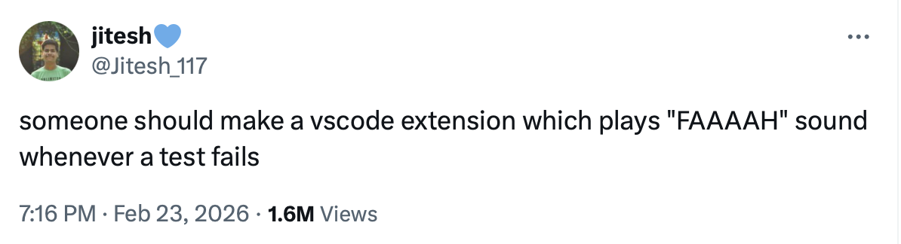

# Faaalty

> Get faaatified on terminal error.

Plays the **"FAAAAH"** sound every time a terminal command fails — so you never silently miss an error again.

## Inspiration

<p align="center">
  
</p>

## Features

- Automatic alert on any non-zero exit code in the integrated terminal
- Cross-platform audio playback (macOS · Windows · Linux)
- Configurable cooldown to avoid alert fatigue
- Manual **Faaalty: Test Sound** command to preview the alert

## Getting Started

1. Install the extension (see below).
2. Make sure shell integration is enabled:
   ```json
   "terminal.integrated.shellIntegration.enabled": true
   ```
3. Run a failing command in the terminal (e.g. `ls /nope`).
4. Hear the **FAAAAH**.

## Install

### From VSIX

```sh
code --install-extension faaalty-0.1.0.vsix
```

### Development

1. Clone this repo and open it in VS Code.
2. Press **F5** to launch the Extension Development Host.

## Command

| Command | Description |
|---|---|
| **Faaalty: Test Sound** | Play the alert sound manually |

## Settings

| Setting | Default | Description |
|---|---|---|
| `faaalty.enabled` | `true` | Enable or disable alerts |
| `faaalty.cooldownMs` | `2000` | Minimum milliseconds between consecutive alerts |

The bundled `assets/faaa.mp3` is played by default. If the file is missing, a system fallback sound is used instead.

## Requirements

- VS Code **1.93** or newer
- Terminal shell integration must be enabled

## License

[MIT](LICENSE)
